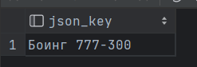
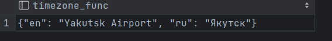

# task1
```sql
create or replace function json_key(key varchar(10))
    returns text
    language plpgsql
as
$$
declare
    val text;
begin
    select model::json ->> key
    into val
    from aircrafts_data;
    return val;
end;
$$;


select json_key('ru');
```

#  

# task2
```sql
create or replace function timezone_func(key varchar(100))
    returns text
    language plpgsql
as
$$
declare
    val text;
begin
    select airport_name
    into val
    from airports_data
    where timezone = key;
    return val;
end;
$$;

select timezone_func('Asia/Yakutsk')
```


# task3
```sql
create or replace function task3(key varchar(100))
    returns text
    language plpgsql
as
$$
declare
    val text;
begin
    select city::json ->> key
    into val
    from airports_data;
    return upper(val);
end;
$$;

select task3('en')
```

