From the following table, write a SQL query to locate the details of customers with grade values above 100. Return
customer_id, cust_name, city, grade, and salesman_id

```sql
SELECT *
FROM customer
where grade >= 100;
```

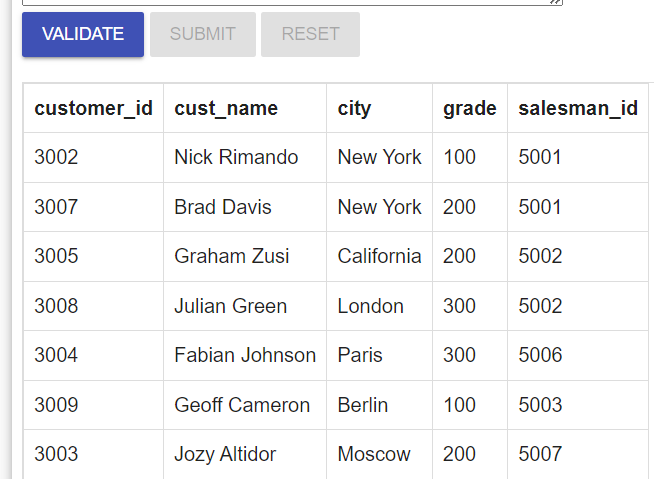

#         

2. From the following table, write a SQL query to find all the customers in ‘New York’ city who have a grade value above
    100. Return customer_id, cust_name, city, grade, and salesman_id

```sql
SELECT *
FROM customer
where grade >= 100
  and city = 'New York';
```

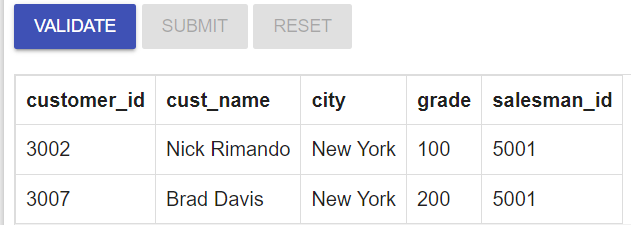

#         

3. From the following table, write a SQL query to find customers who are from the city of New York or have a grade of
   over 100. Return customer_id, cust_name, city, grade, and salesman_id

```sql
SELECT *
FROM customer
where grade >= 100
   or city = 'New York';
```

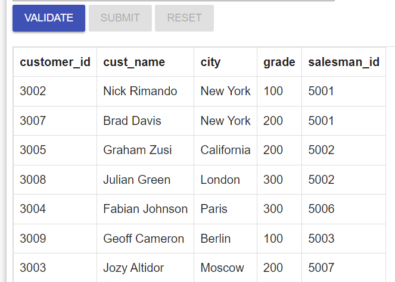

#       

4. From the following table, write a SQL query to find customers who are either from the city 'New York' or who do not
   have a grade greater than 100. Return customer_id, cust_name, city, grade, and salesman_id

```sql
SELECT *
FROM customer
WHERE grade < 100
   or city = 'New York' 
```

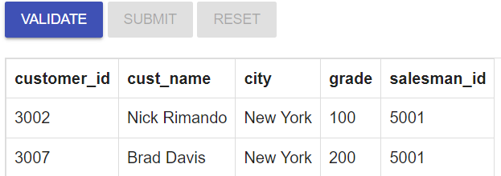

#      

5. From the following table, write a SQL query to identify customers who do not belong to the city of 'New York' or have
   a grade value that exceeds 100. Return customer_id, cust_name, city, grade, and salesman_id.

```sql
SELECT *
FROM customer
WHERE grade > 100
   or city != 'New York' 
```

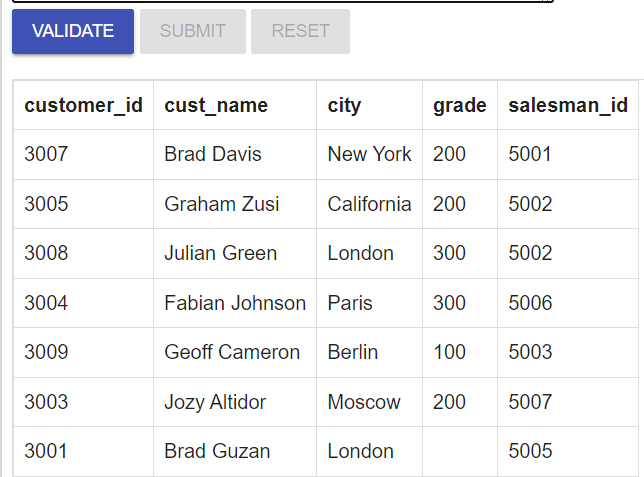

#      

6. From the following table, write a SQL query to find details of all orders excluding those with ord_date equal to '
   2012-09-10' and salesman_id higher than 5005 or purch_amt greater than 1000.Return ord_no, purch_amt, ord_date,
   customer_id and salesman_id

```sql
SELECT *
FROM orders
WHERE (ord_date = '2012-09-10' and salesman_id >= 5005)
   or purch_amt >= 1000;
```

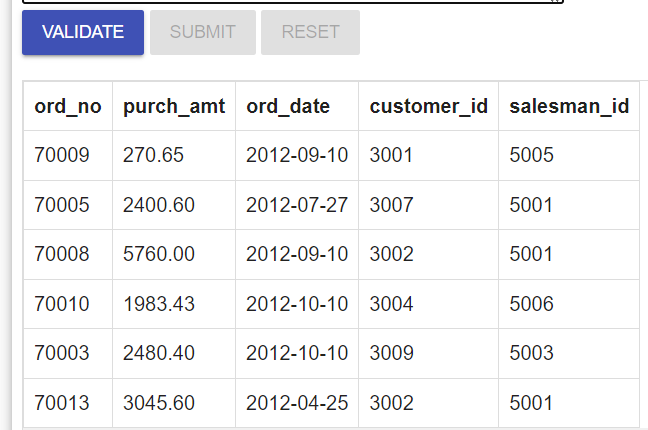

#                                                                

7. From the following table, write a SQL query to find the details of those salespeople whose commissions range from
   0.10 to0.12. Return salesman_id, name, city, and commission.

```sql
SELECT *
FROM salesman
WHERE commission BETWEEN 0.10 AND 0.12;
```

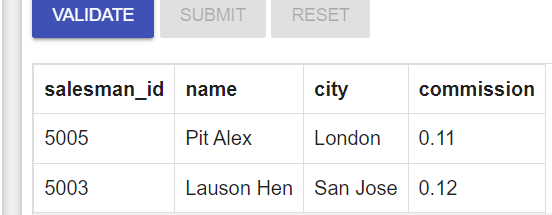

#    

8. From the following table, write a SQL query to find details of all orders with a purchase amount less than 200 or
   exclude orders with an order date greater than or equal to '2012-02-10' and a customer ID less than 3009. Return
   ord_no, purch_amt, ord_date, customer_id and salesman_id.

```sql
SELECT ord_no, purch_amt, ord_date, customer_id, salesman_id
FROM orders
WHERE purch_amt < 200
   OR (ord_date >= '2012-02-10' OR customer_id < 3009);
```

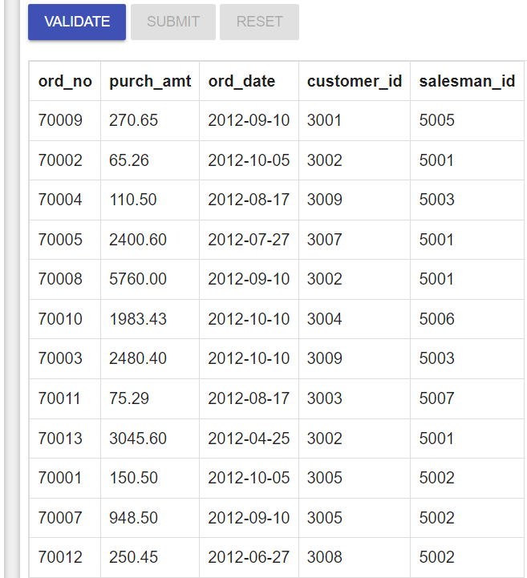

#     

9. From the following table, write a SQL query to find all orders that meet the following conditions. Exclude
   combinations of order date equal to '2012-08-17' or customer ID greater than 3005 and purchase amount less than 1000

```sql
SELECT *
FROM orders
WHERE purch_amt > 1000
  and (ord_date > '2012-08-17' OR customer_id > 3005);
```

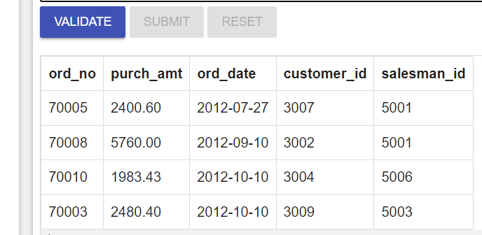

#    

10. Write a SQL query that displays order number, purchase amount, and the achieved and unachieved percentage (%) for
    those orders that exceed 50% of the target value of 6000.

```sql
SELECT ord_no,
       purch_amt,
       (100 * purch_amt) / 6000          AS "Achieved %",
       (100 * (6000 - purch_amt) / 6000) AS "Unachieved %"
FROM orders
WHERE (100 * purch_amt) / 6000 > 50;
```

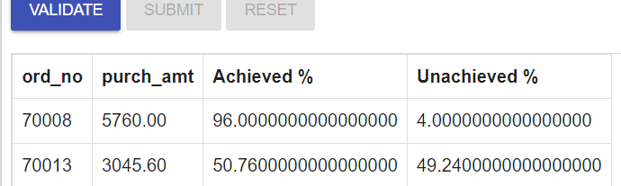

#     

11. From the following table, write a SQL query to find the details of all employees whose last name is ‘Dosni’ or
    ‘Mardy’. Return emp_idno, emp_fname, emp_lname, and emp_dept.

```sql
SELECT *
FROM emp_details
WHERE emp_lname = 'Dosni'
   OR emp_lname = 'Mardy';
```

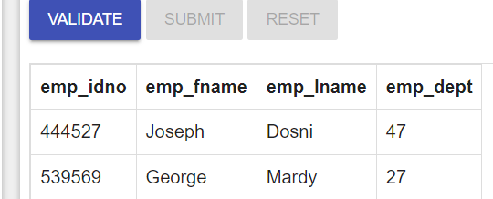

#   

12. From the following table, write a SQL query to find the employees who work at depart 47 or 63. Return emp_idno,
    emp_fname, emp_lname, and emp_dept.
```sql
SELECT * 
 FROM emp_details
  WHERE emp_dept = 47 OR emp_dept = 63;
```
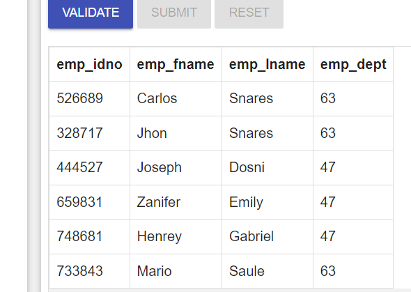


