1. From the following table, write a SQL query to find the details of those salespeople who come from the 'Paris' City
   or 'Rome' City. Return salesman_id, name, city, commission.

```sql
SELECT *
FROM salesman
where city = 'Paris'
   or city = 'Rome'
```

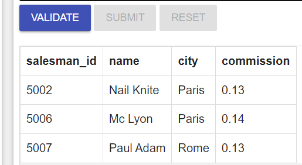

#                

2. From the following table, write a SQL query to find the details of the salespeople who come from either 'Paris' or '
   Rome'. Return salesman_id, name, city, commission.

```sql
SELECT *
FROM salesman
where city = 'Paris'
   or city = 'Rome'
```


#                

3. From the following table, write a SQL query to find the details of those salespeople who live in cities other than
   Paris and Rome. Return salesman_id, name, city, commission.

```sql
SELECT *
FROM salesman
where city != 'Paris'
  and city != 'Rome'
```

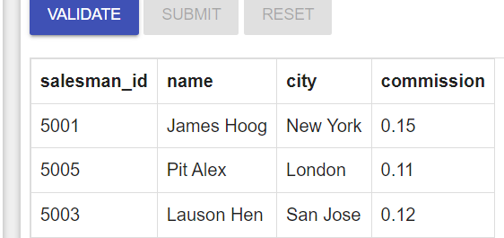

#               

4. From the following table, write a SQL query to retrieve the details of all customers whose ID belongs to any of the
   values 3007, 3008 or 3009.

```sql
SELECT *
FROM customer
where customer_id = 3007
   or customer_id = 3008
   or customer_id = 3009
```

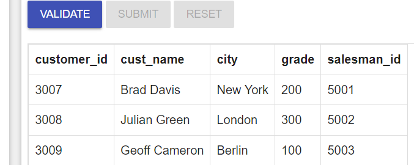

#              

5. From the following table, write a SQL query to find salespeople who receive commissions between 0.12 and 0.14 (begin
   and end values are included). Return salesman_id, name, city, and commission.

```sql
SELECT *
FROM salesman
where commission between 0.12 and 0.14
```

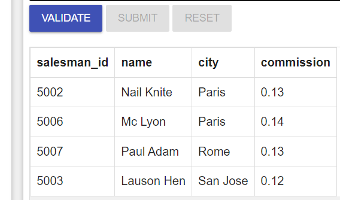

#            

6. From the following table, write a SQL query to select orders between 500 and 4000 (begin and end values are
   included). Exclude orders amount 948.50 and 1983.43. Return ord_no, purch_amt, ord_date, customer_id, and
   salesman_id.

```sql
SELECT *
FROM orders
WHERE (purch_amt BETWEEN 500 AND 4000)
  AND NOT purch_amt IN (948.50, 1983.43);    
```

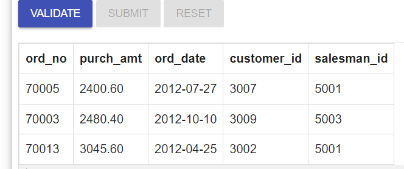

#           

7. From the following table, write a SQL query to retrieve the details of the salespeople whose names begin with any
   letter between 'A' and 'L' (not inclusive). Return salesman_id, name, city, commission

```sql
SELECT *
FROM salesman
WHERE name BETWEEN 'A' and 'L';
```

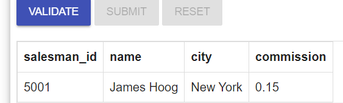

#          

8. From the following table, write a SQL query to find the details of all salespeople except those whose names begin
   with any letter between 'A' and 'L' (not inclusive). Return salesman_id, name, city, commission.

```sql
SELECT *
FROM salesman
WHERE name NOT BETWEEN 'A' and 'L';
```

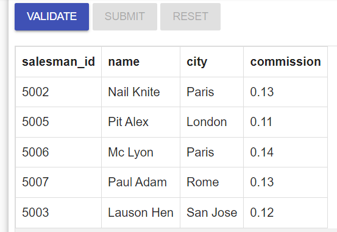

#          

9. From the following table, write a SQL query to retrieve the details of the customers whose names begins with the
   letter 'B'. Return customer_id, cust_name, city, grade, salesman_id.

```sql
SELECT *
FROM customer
where cust_name like 'B%';
```

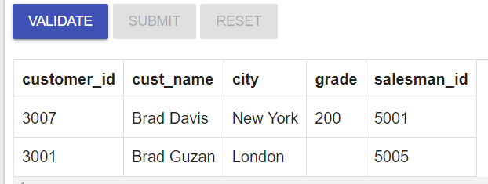

#         

10. From the following table, write a SQL query to find the details of the customers whose names end with the letter '
    n'. Return customer_id, cust_name, city, grade, salesman_id.

```sql
SELECT *
FROM customer
WHERE cust_name LIKE '%n';
```

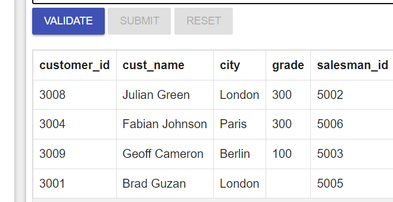

#       

11. From the following table, write a SQL query to find the details of those salespeople whose names begin with ‘N’ and
    the fourth character is 'l'. Rests may be any character. Return salesman_id, name, city, commission.

```sql
SELECT *
FROM salesman
WHERE name LIKE 'N__l%';
```

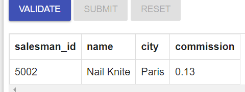

#      

12. From the following table, write a SQL query to find those rows where col1 contains the escape character
    underscore ( _ ). Return col1.

```sql
SELECT *
FROM testtable
WHERE col1 LIKE '%/_%' ESCAPE '/';
```

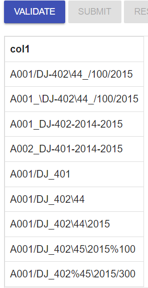

#     

13. From the following table, write a SQL query to identify those rows where col1 does not contain the escape character
    underscore ( _ ). Return col1.

```sql
SELECT *
FROM testtable
WHERE col1 NOT LIKE '%/_%' ESCAPE '/';
```

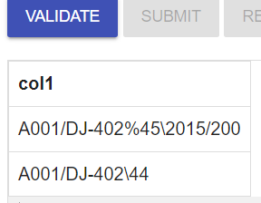

#    

14. From the following table, write a SQL query to find rows in which col1 contains the forward slash character ( / ).
    Return col1.

```sql
SELECT *
FROM testtable
WHERE col1 LIKE '%//%' ESCAPE '/';
```

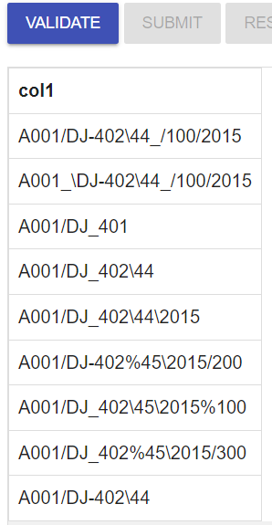

#   

15. From the following table, write a SQL query to identify those rows where col1 does not contain the forward slash
    character ( / ). Return col1.
```sql
SELECT *
FROM testtable
WHERE col1 NOT LIKE '%//%' ESCAPE '/';
```
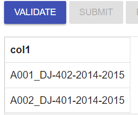
#   


