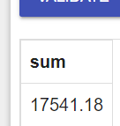
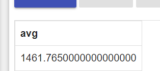
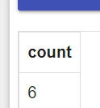
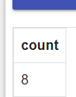
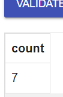
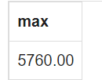

1. From the following table, write a SQL query to calculate total purchase amount of all orders. Return total purchase
   amount

```sql
SELECT SUM(purch_amt)
FROM orders
```



#   

2. From the following table, write a SQL query to calculate the average purchase amount of all orders. Return average
   purchase amount.
```sql
SELECT AVG(purch_amt) FROM orders
```

#   

3. From the following table, write a SQL query that counts the number of unique salespeople. Return number of salespeople.
```sql
SELECT COUNT (DISTINCT salesman_id) 
FROM orders;
```

#   

4. From the following table, write a SQL query to count the number of customers. Return number of customers.
```sql
SELECT COUNT (DISTINCT customer_id) 
FROM customer;
```

#  

5. From the following table, write a SQL query to determine the number of customers who received at least one grade for their activity.
```sql
SELECT COUNT (ALL grade) 
FROM customer;
```

#   

6. From the following table, write a SQL query to find the maximum purchase amount.    Go to the editor
```sql
SELECT max(purch_amt) 
FROM orders;
```

#   


