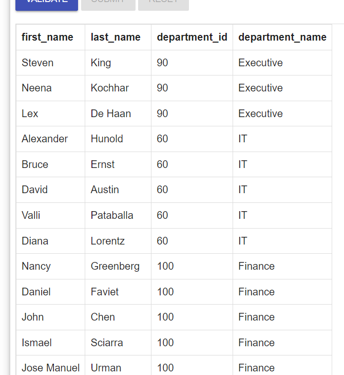
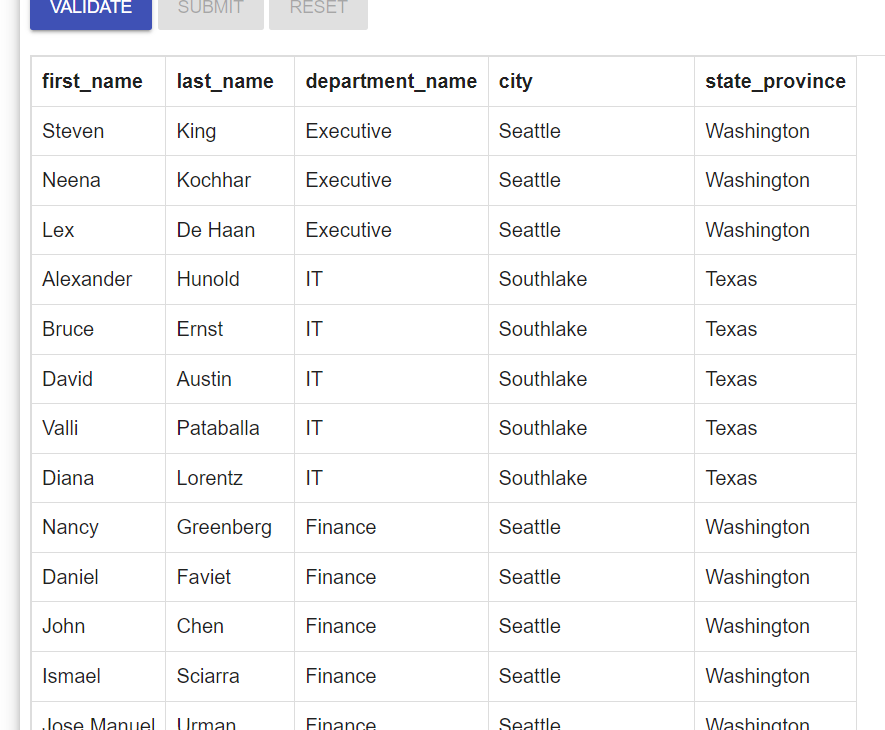
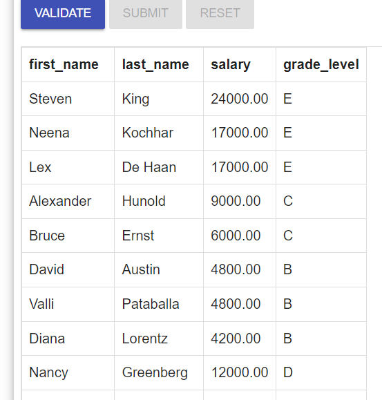
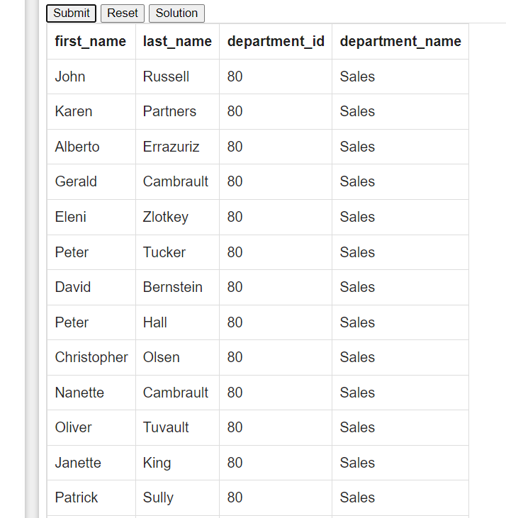
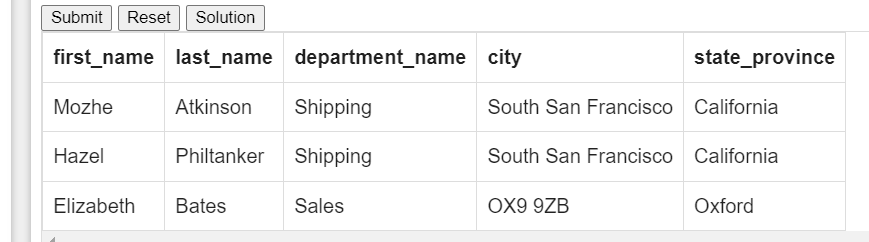

# 1
```sql
SELECT E.first_name , E.last_name , 
       E.department_id , D.department_name 
        FROM employees E 
         JOIN departments D 
          ON E.department_id = D.department_id;
```

 

# 2.
```sql
 select E.first_name,E.last_name, 
   D.department_name, L.city, L.state_province
   from employees E
   join departments D
   on E.department_id = D.department_id
   join locations L
   on D.location_id = L.location_id
```


# 3
```sql
SELECT E.first_name, E.last_name, E.salary, J.grade_level
 FROM employees E 
   JOIN job_grades J
     ON E.salary BETWEEN J.lowest_sal AND J.highest_sal;
```


#   4
```sql
select E.first_name,
       E.last_name,
       E.department_id,
       D.department_name
from departments D
         join employees E
              on E.department_id = D.department_id and E.department_id in (40, 80)
```


# 5
```sql
select E.first_name,
        E.last_name,
        D.department_name,
        L.city,
        L.state_province
from employees E
          join departments D
               on E.department_id = D.department_id
          join locations L
               on D.location_id = L.location_id
where E.first_name like '%z%';
```


