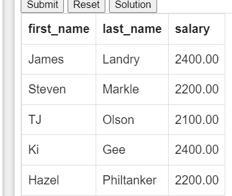
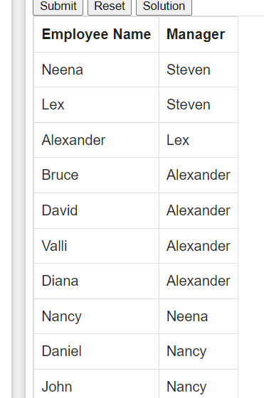
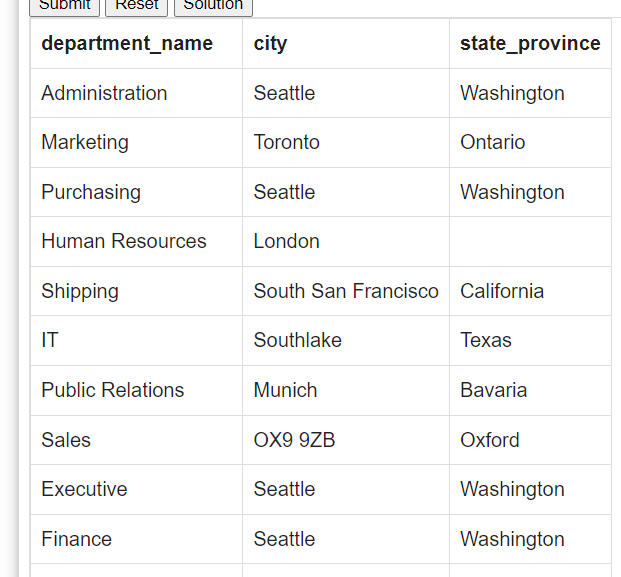
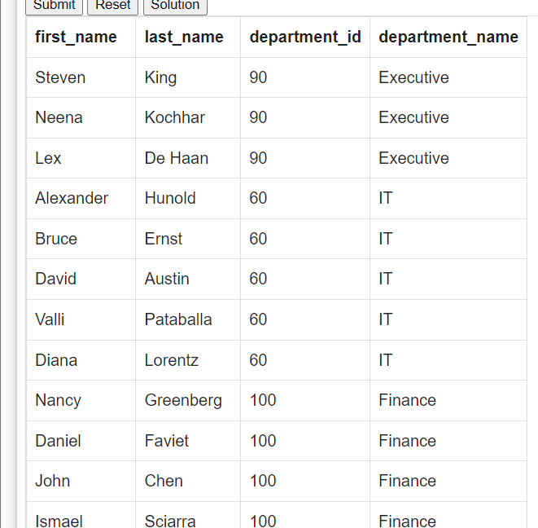
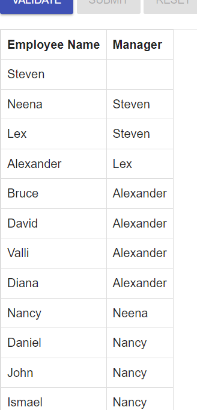
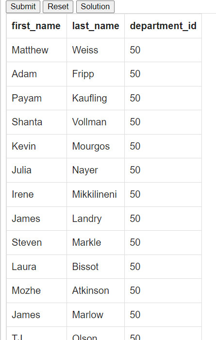
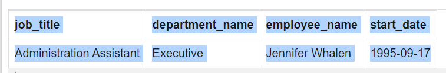

# 1
```sql
SELECT E.first_name , E.last_name , 
       E.department_id , D.department_name 
        FROM employees E 
         JOIN departments D 
          ON E.department_id = D.department_id;
```

 

# 2.
```sql
 select E.first_name,E.last_name, 
   D.department_name, L.city, L.state_province
   from employees E
   join departments D
   on E.department_id = D.department_id
   join locations L
   on D.location_id = L.location_id
```


# 3
```sql
SELECT E.first_name, E.last_name, E.salary, J.grade_level
 FROM employees E 
   JOIN job_grades J
     ON E.salary BETWEEN J.lowest_sal AND J.highest_sal;
```


#   4
```sql
select E.first_name,
       E.last_name,
       E.department_id,
       D.department_name
from departments D
         join employees E
              on E.department_id = D.department_id and E.department_id in (40, 80)
```


# 5
```sql
select E.first_name,
        E.last_name,
        D.department_name,
        L.city,
        L.state_province
from employees E
          join departments D
               on E.department_id = D.department_id
          join locations L
               on D.location_id = L.location_id
where E.first_name like '%z%';
```


# 6 
```sql
SELECT E.first_name, E.last_name, D.department_id, D.department_name 
 FROM employees E 
   RIGHT OUTER JOIN departments D
     ON E.department_id = D.department_id;
```


# 7
```sql
SELECT E.first_name, E.last_name, E.salary 
  FROM employees E 
   JOIN employees S
     ON E.salary < S.salary 
      AND S.employee_id = 182;
```


# 8 
```sql
SELECT E.first_name AS "Employee Name", 
   S.first_name AS "Manager" 
  FROM employees E 
   JOIN employees S
     ON E.MANAGER_ID = S.EMPLOYEE_ID
```


# 9 
```sql
select D.department_name, L.city, L.state_province
from departments D
join locations L
on D.location_id = L.location_id;
```
     

# 10.
```sql
SELECT E.first_name, E.last_name, E.department_id, D.department_name 
  FROM employees E 
   LEFT OUTER JOIN departments D 
     ON E.department_id = D.department_id;
```


# 11

```sql
SELECT E.first_name AS "Employee Name",
   M.first_name AS "Manager"
    FROM employees E 
      LEFT OUTER JOIN employees M
       ON E.manager_id = M.employee_id;
```


# 12. 
```sql
SELECT E.first_name, E.last_name, E.department_id 
  FROM employees E 
  JOIN employees S 
     ON E.department_id = S.department_id
and S.last_name= 'Taylor';
```


# 13.  
```sql
SELECT job_title, department_name, first_name || ' ' || last_name AS Employee_name, start_date 
	FROM job_history 
		JOIN jobs USING (job_id) 
			JOIN departments USING (department_id) 
				JOIN  employees USING (employee_id) 
					WHERE start_date>='1993-01-01' AND start_date<='1997-08-31';
```



