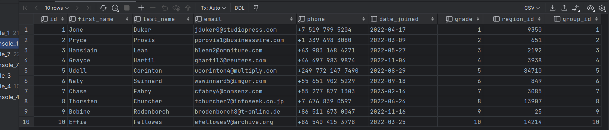
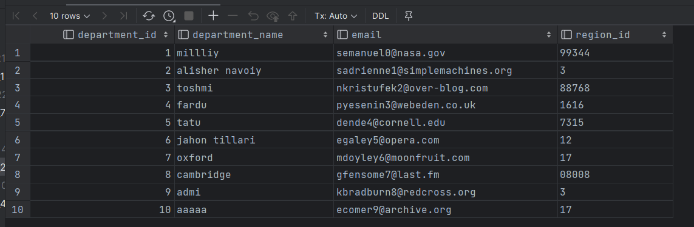
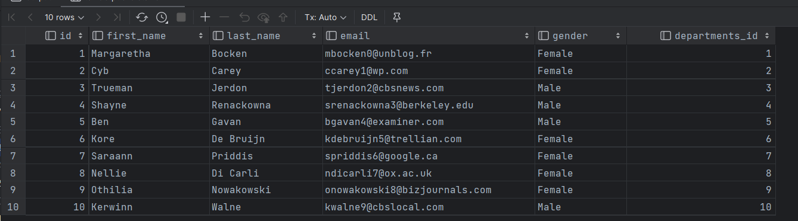
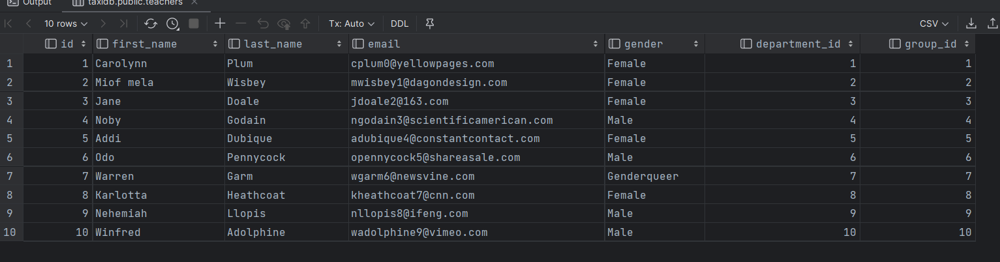
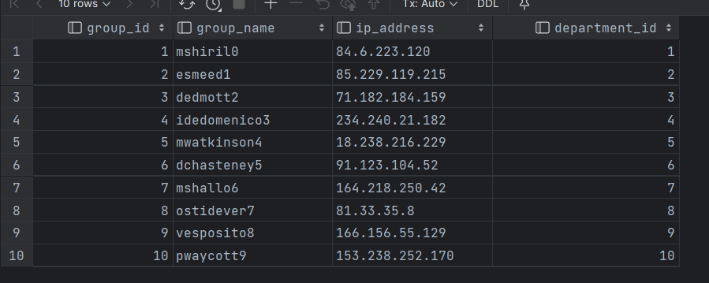
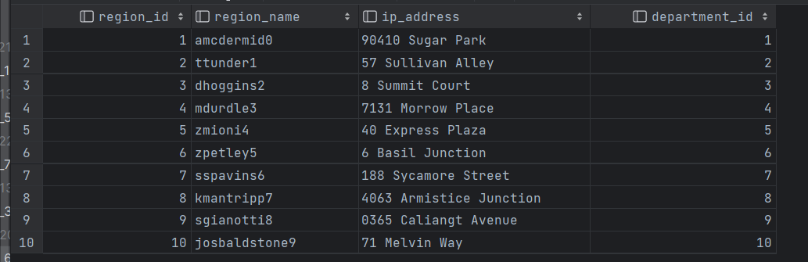
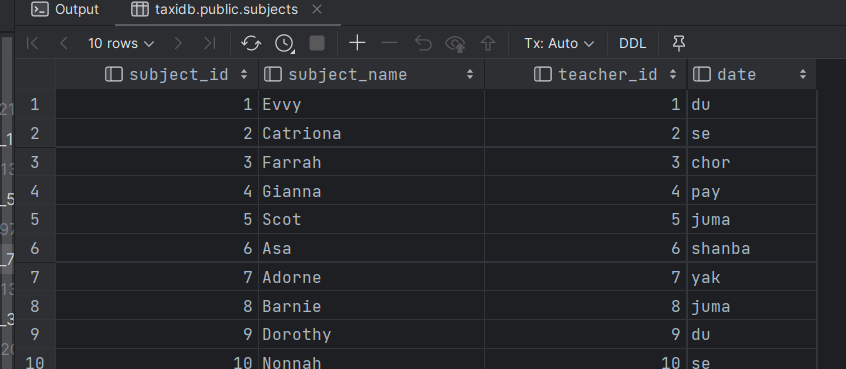

```sql
create table Students
(
    id             serial,
    first_name     varchar(100)        not null,
    last_name      varchar(100)        not null,
    email       varchar(100) unique not null,
    phone          varchar(20) unique  not null,
    date_joined    date,
    grade          integer             not null,
    region_id      integer,
    group_id       integer
);

insert into Students (id, first_name, last_name, email, phone, date_joined, grade, region_id, group_id) values (1, 'Jone', 'Duker', 'jduker0@studiopress.com', '+7 519 799 5204', '4/17/2022', 1, '9350', 1);
insert into Students (id, first_name, last_name, email, phone, date_joined, grade, region_id, group_id) values (2, 'Pryce', 'Provis', 'pprovis1@businesswire.com', '+1 339 698 3080', '3/9/2022', 2, '651', 2);
insert into Students (id, first_name, last_name, email, phone, date_joined, grade, region_id, group_id) values (3, 'Hansiain', 'Lean', 'hlean2@omniture.com', '+63 983 168 4271', '5/27/2022', 3, '2192', 3);
insert into Students (id, first_name, last_name, email, phone, date_joined, grade, region_id, group_id) values (4, 'Grayce', 'Hartil', 'ghartil3@reuters.com', '+46 497 983 9874', '11/4/2022', 4, '3938', 4);
insert into Students (id, first_name, last_name, email, phone, date_joined, grade, region_id, group_id) values (5, 'Udell', 'Corinton', 'ucorinton4@multiply.com', '+249 772 147 7490', '8/29/2022', 5, '84710', 5);
insert into Students (id, first_name, last_name, email, phone, date_joined, grade, region_id, group_id) values (6, 'Waly', 'Swinnard', 'wswinnard5@imgur.com', '+55 651 902 5229', '9/18/2022', 6, '0849', 6);
insert into Students (id, first_name, last_name, email, phone, date_joined, grade, region_id, group_id) values (7, 'Chase', 'Fabry', 'cfabry6@comsenz.com', '+55 277 877 1303', '2/14/2023', 7, '3085', 7);
insert into Students (id, first_name, last_name, email, phone, date_joined, grade, region_id, group_id) values (8, 'Thorsten', 'Churcher', 'tchurcher7@infoseek.co.jp', '+7 676 839 0597', '6/24/2022', 8, '13907', 8);
insert into Students (id, first_name, last_name, email, phone, date_joined, grade, region_id, group_id) values (9, 'Bobine', 'Rodenborch', 'brodenborch8@t-online.de', '+86 511 673 0047', '11/16/2022', 9, '25', 9);
insert into Students (id, first_name, last_name, email, phone, date_joined, grade, region_id, group_id) values (10, 'Effie', 'Fellowes', 'efellowes9@archive.org', '+86 540 415 3778', '3/25/2022', 10, '14214', 10);

select *
from Students
```

#  

```sql
create table Departments (
	department_id int,
	department_name VARCHAR(50),
	email VARCHAR(50),
	region_id VARCHAR(50)
);
insert into Departments (department_id, department_name, email, region_id) values (1, 'millliy', 'semanuel0@nasa.gov', '99344');
insert into Departments (department_id, department_name, email, region_id) values (2, 'alisher navoiy', 'sadrienne1@simplemachines.org', '3');
insert into Departments (department_id, department_name, email, region_id) values (3, 'toshmi', 'nkristufek2@over-blog.com', '88768');
insert into Departments (department_id, department_name, email, region_id) values (4, 'fardu', 'pyesenin3@webeden.co.uk', '1616');
insert into Departments (department_id, department_name, email, region_id) values (5, 'tatu', 'dende4@cornell.edu', '7315');
insert into Departments (department_id, department_name, email, region_id) values (6, 'jahon tillari', 'egaley5@opera.com', '12');
insert into Departments (department_id, department_name, email, region_id) values (7, 'oxford', 'mdoyley6@moonfruit.com', '17');
insert into Departments (department_id, department_name, email, region_id) values (8, 'cambridge', 'gfensome7@last.fm', '08008');
insert into Departments (department_id, department_name, email, region_id) values (9, 'admi', 'kbradburn8@redcross.org', '3');
insert into Departments (department_id, department_name, email, region_id) values (10, 'aaaaa', 'ecomer9@archive.org', '17');

select * from departments
```

#   

```sql
create table Staffs (
	id int,
	first_name VARCHAR(50),
	last_name VARCHAR(50),
	email VARCHAR(50),
	gender VARCHAR(50),
	departments_id int
);
insert into Staffs (id, first_name, last_name, email, gender, departments_id) values (1, 'Margaretha', 'Bocken', 'mbocken0@unblog.fr', 'Female', 1);
insert into Staffs (id, first_name, last_name, email, gender, departments_id) values (2, 'Cyb', 'Carey', 'ccarey1@wp.com', 'Female', 2);
insert into Staffs (id, first_name, last_name, email, gender, departments_id) values (3, 'Trueman', 'Jerdon', 'tjerdon2@cbsnews.com', 'Male', 3);
insert into Staffs (id, first_name, last_name, email, gender, departments_id) values (4, 'Shayne', 'Renackowna', 'srenackowna3@berkeley.edu', 'Male', 4);
insert into Staffs (id, first_name, last_name, email, gender, departments_id) values (5, 'Ben', 'Gavan', 'bgavan4@examiner.com', 'Male', 5);
insert into Staffs (id, first_name, last_name, email, gender, departments_id) values (6, 'Kore', 'De Bruijn', 'kdebruijn5@trellian.com', 'Female', 6);
insert into Staffs (id, first_name, last_name, email, gender, departments_id) values (7, 'Saraann', 'Priddis', 'spriddis6@google.ca', 'Female', 7);
insert into Staffs (id, first_name, last_name, email, gender, departments_id) values (8, 'Nellie', 'Di Carli', 'ndicarli7@ox.ac.uk', 'Female', 8);
insert into Staffs (id, first_name, last_name, email, gender, departments_id) values (9, 'Othilia', 'Nowakowski', 'onowakowski8@bizjournals.com', 'Female', 9);
insert into Staffs (id, first_name, last_name, email, gender, departments_id) values (10, 'Kerwinn', 'Walne', 'kwalne9@cbslocal.com', 'Male', 10);

select * from Staffs;
```

#  

```sql
create table Teachers (
	id int,
	first_name VARCHAR(50),
	last_name VARCHAR(50),
	email VARCHAR(50),
	gender VARCHAR(50),
	department_id int,
	group_id int
);
insert into Teachers (id, first_name, last_name, email, gender, department_id, group_id) values (1, 'Carolynn', 'Plum', 'cplum0@yellowpages.com', 'Female', 1, 1);
insert into Teachers (id, first_name, last_name, email, gender, department_id, group_id) values (2, 'Miof mela', 'Wisbey', 'mwisbey1@dagondesign.com', 'Female', 2, 2);
insert into Teachers (id, first_name, last_name, email, gender, department_id, group_id) values (3, 'Jane', 'Doale', 'jdoale2@163.com', 'Female', 3, 3);
insert into Teachers (id, first_name, last_name, email, gender, department_id, group_id) values (4, 'Noby', 'Godain', 'ngodain3@scientificamerican.com', 'Male', 4, 4);
insert into Teachers (id, first_name, last_name, email, gender, department_id, group_id) values (5, 'Addi', 'Dubique', 'adubique4@constantcontact.com', 'Female', 5, 5);
insert into Teachers (id, first_name, last_name, email, gender, department_id, group_id) values (6, 'Odo', 'Pennycock', 'opennycock5@shareasale.com', 'Male', 6, 6);
insert into Teachers (id, first_name, last_name, email, gender, department_id, group_id) values (7, 'Warren', 'Garm', 'wgarm6@newsvine.com', 'Genderqueer', 7, 7);
insert into Teachers (id, first_name, last_name, email, gender, department_id, group_id) values (8, 'Karlotta', 'Heathcoat', 'kheathcoat7@cnn.com', 'Female', 8, 8);
insert into Teachers (id, first_name, last_name, email, gender, department_id, group_id) values (9, 'Nehemiah', 'Llopis', 'nllopis8@ifeng.com', 'Male', 9, 9);
insert into Teachers (id, first_name, last_name, email, gender, department_id, group_id) values (10, 'Winfred', 'Adolphine', 'wadolphine9@vimeo.com', 'Male', 10, 10);

select * from teachers
```

#  

```sql
create table Groups (
	group_id int,
	group_name VARCHAR(50),
	ip_address VARCHAR(20),
	department_id int
);
insert into Groups (group_id, group_name, ip_address, department_id) values (1, 'mshiril0', '84.6.223.120', 1);
insert into Groups (group_id, group_name, ip_address, department_id) values (2, 'esmeed1', '85.229.119.215', 2);
insert into Groups (group_id, group_name, ip_address, department_id) values (3, 'dedmott2', '71.182.184.159', 3);
insert into Groups (group_id, group_name, ip_address, department_id) values (4, 'idedomenico3', '234.240.21.182', 4);
insert into Groups (group_id, group_name, ip_address, department_id) values (5, 'mwatkinson4', '18.238.216.229', 5);
insert into Groups (group_id, group_name, ip_address, department_id) values (6, 'dchasteney5', '91.123.104.52', 6);
insert into Groups (group_id, group_name, ip_address, department_id) values (7, 'mshallo6', '164.218.250.42', 7);
insert into Groups (group_id, group_name, ip_address, department_id) values (8, 'ostidever7', '81.33.35.8', 8);
insert into Groups (group_id, group_name, ip_address, department_id) values (9, 'vesposito8', '166.156.55.129', 9);
insert into Groups (group_id, group_name, ip_address, department_id) values (10, 'pwaycott9', '153.238.252.170', 10);

select * from groups
```

#   

```sql
create table Regions (
	region_id int,
	region_name VARCHAR(50),
	ip_address VARCHAR(50),
	department_id int
);
insert into Regions (region_id, region_name, ip_address, department_id) values (1, 'amcdermid0', '90410 Sugar Park', 1);
insert into Regions (region_id, region_name, ip_address, department_id) values (2, 'ttunder1', '57 Sullivan Alley', 2);
insert into Regions (region_id, region_name, ip_address, department_id) values (3, 'dhoggins2', '8 Summit Court', 3);
insert into Regions (region_id, region_name, ip_address, department_id) values (4, 'mdurdle3', '7131 Morrow Place', 4);
insert into Regions (region_id, region_name, ip_address, department_id) values (5, 'zmioni4', '40 Express Plaza', 5);
insert into Regions (region_id, region_name, ip_address, department_id) values (6, 'zpetley5', '6 Basil Junction', 6);
insert into Regions (region_id, region_name, ip_address, department_id) values (7, 'sspavins6', '188 Sycamore Street', 7);
insert into Regions (region_id, region_name, ip_address, department_id) values (8, 'kmantripp7', '4063 Armistice Junction', 8);
insert into Regions (region_id, region_name, ip_address, department_id) values (9, 'sgianotti8', '0365 Caliangt Avenue', 9);
insert into Regions (region_id, region_name, ip_address, department_id) values (10, 'josbaldstone9', '71 Melvin Way', 10);


select * from regions
```

#  

```sql
create table subjects (
	subject_id int,
	subject_name VARCHAR(50),
	teacher_id int,
	date VARCHAR(50)
);
insert into subjects (subject_id, subject_name, teacher_id, date) values (1, 'Evvy', 1, 'du');
insert into subjects (subject_id, subject_name, teacher_id, date) values (2, 'Catriona', 2, 'se');
insert into subjects (subject_id, subject_name, teacher_id, date) values (3, 'Farrah', 3, 'chor');
insert into subjects (subject_id, subject_name, teacher_id, date) values (4, 'Gianna', 4, 'pay');
insert into subjects (subject_id, subject_name, teacher_id, date) values (5, 'Scot', 5, 'juma');
insert into subjects (subject_id, subject_name, teacher_id, date) values (6, 'Asa', 6, 'shanba');
insert into subjects (subject_id, subject_name, teacher_id, date) values (7, 'Adorne', 7, 'yak');
insert into subjects (subject_id, subject_name, teacher_id, date) values (8, 'Barnie', 8, 'juma');
insert into subjects (subject_id, subject_name, teacher_id, date) values (9, 'Dorothy', 9, 'du');
insert into subjects (subject_id, subject_name, teacher_id, date) values (10, 'Nonnah', 10, 'se');

select * from subjects
```



